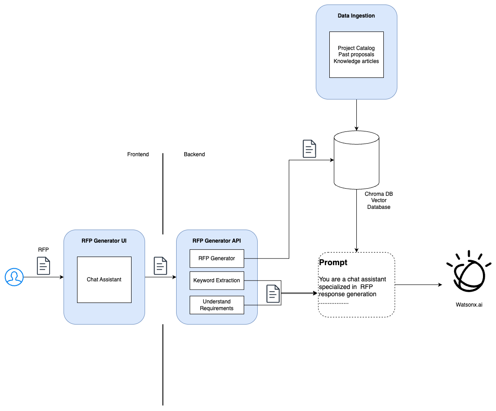

# watsonx-rfp-generator
The RFP Generator project is a chat-based assistant designed to streamline the process of responding to Requests for Proposals (RFPs). It leverages IBM watsonx.ai, retrieval-augmented generation (RAG), and a custom vector database of past proposals to generate RFP responses tailored to your organization's institutional knowledge. Through natural language processing and AI-driven document analysis, it extracts key insights and enables efficient proposal generation via an intuitive Chatlit interface.

## 📄 Project Summary

### ❗ The Issue We Are Hoping to Solve
Organizations frequently face significant challenges in responding to RFPs, which are often high-stakes and time-sensitive. Despite their importance in securing new business, the RFP process remains inefficient and inconsistent. Our solution addresses several core pain points:

#### Fast Turnaround Needs
RFPs often require responses within days. Teams struggle to quickly understand requirements, coordinate inputs, and produce polished proposals—frequently leading to compromises in quality.

#### Unstructured and Hard-to-Digest Requirements
RFPs are typically dense, technical, and unstructured. Extracting critical elements like scope, deliverables, and evaluation criteria is slow and error-prone. Without a familiar format, teams lack consistency and efficiency.

#### Challenges in Tailoring Responses to Organizational Strengths
Many organizations possess a wealth of prior proposals, case studies, and domain knowledge—yet this information is often scattered across silos or buried in unsearchable documents. As a result, teams either start from scratch or use generic boilerplate content, reducing the relevance and impact of the response.

#### Manual, Repetitive Work
Writing proposals from the ground up leads to duplication, inconsistent messaging, and unnecessary time spent formatting and sourcing inputs.

### 💡 How Our Technology Solution Can Help
RFP Generator uses AI and RAG techniques to enhance every stage of proposal development:

#### Structured Breakdown of RFPs
The tool leverages watsonx.ai to parse and organize RFP content into standardized, easy-to-navigate sections—such as objectives, deliverables, timelines, and compliance requirements—allowing teams to work more efficiently within a familiar framework.

#### Keyword and Taxonomy Extraction
The solution extracts domain-specific keywords and builds a taxonomy of requirements, stakeholders, and focus areas. This improves clarity, enables tagging and routing, and helps users quickly understand the project's scope and relevance.

#### Tailored Content Generation via RAG
By integrating a Retrieval-Augmented Generation (RAG) pipeline with a vector database of prior proposals, the system generates customized responses that align closely with the organization’s experience and strengths.

#### Fast and Consistent Output
Through structured analysis, contextual retrieval, and generative AI, RFP Generator enables rapid proposal creation—reducing manual work and improving consistency and quality.

### 🧠 How RAG and Watsonx.ai power RFP Generator
The solution integrates IBM watsonx.ai and Retrieval-Augmented Generation (RAG) to automate and personalize RFP responses.

To build a tailored and context-rich responses, Retrieval Augmented Generation involves two phases:

#### Data Ingestion  (Preprocessing Phase)
The system ingests the organization’s institutional knowledge base, which includes an it's:

- The current catalog of active projects

- Past  RFP responses and proposals

- Case studies and knowledge articles

These documents are parsed, cleaned, and chunked. Then, using transformer-based models, they are embedded and stored in a Chroma vector database, enabling semantic similarity search.

#### Runtime – Semantic Retrieval and Content Generation

- Retriever: When an RFP is uploaded, the retriever uses semantic search to query the ChromaDB vector database and retrieve relevant, contextually similar content from the ingested knowledge base. This ensures the system surfaces accurate material aligned with the organization’s past work.

- Generator: The retrieved content is provided as context to a foundation model running on watsonx.ai. The foundation model along with a prompt crafted in the Prompt Lab, generates tailored RFP responses that reflect the organization's value proposition and  domain knowledge.

Additionally, the foundation model is  used to simplify and breakdown the RFP into familiar elements: scope, objectives, timelines, and evaluation criteria - to provide a better understanding of the RFP. It also extracts keywords and taxonomy which can  which can be visualized (e.g., as a word cloud) to highlight key focus areas. 

## Technology implementation
### Architecture 




### Installation

1. Create a .env file containing the following keys

```
WATSONX_AI_KEY=<Watsonx.ai key>
WATSONX_AI_API=https://us-south.ml.cloud.ibm.com
WATSONX_AI_PROJECT_ID=<Watsonx.ai Project ID>
```

2. Create virtual environemt by running following commands
```
python -m venv watsonx-rfp-generator
source watsonx-rfp-generator/bin/activate
```

3. Install dependencies

```
pip install -r requirements.txt
```

4. Start the API server
```
chainlit run app.py -w
```